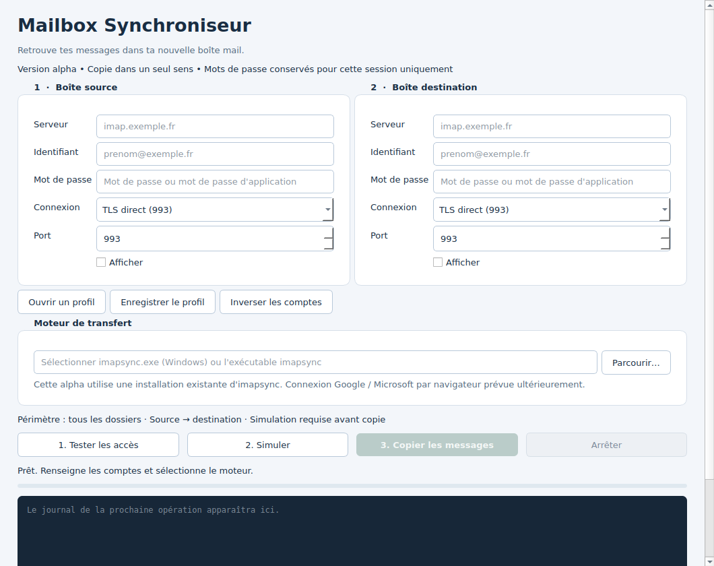
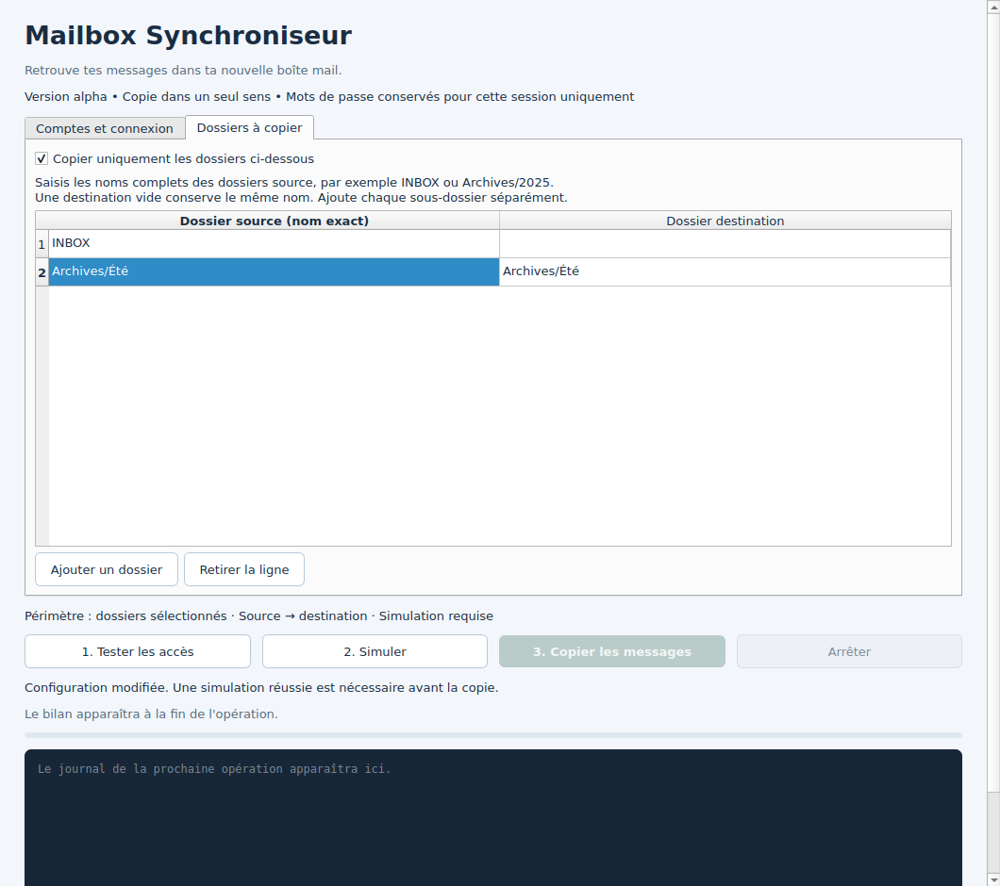
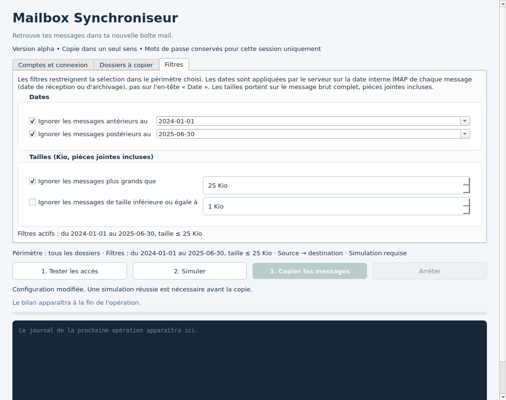

# Mailbox Synchroniseur — 0.3.0 alpha 1

Application de bureau en français pour copier des messages entre deux comptes
IMAP, en pilotant le moteur libre imapsync. Le développement suit [ROADMAP.md](ROADMAP.md).
L'état réel et les prochaines étapes sont dans [STATUS.md](STATUS.md).



## Fonctionnalités

- Configurer source et destination, TLS direct ou STARTTLS.
- Enregistrer/ouvrir un profil sans les mots de passe ; inverser les comptes.
- Piloter un imapsync installé : tester les accès, simuler, puis copier tous les dossiers ou une sélection explicite.
- Renommer les dossiers à destination, y compris les dossiers Unicode et imbriqués.
- Lire un bilan : copiés, ignorés, erreurs et présence des messages identifiés à destination.
- Arrêter un processus ; relancer une simulation avant reprise.
- Lire un journal de session avec masquage des mots de passe connus.
- Filtrer par dates et par taille de message ; lire une estimation du volume après simulation.

La copie est déverrouillée après une simulation réussie. Toute modification des
comptes, ports, mots de passe, dossiers ou chemin du moteur invalide cette simulation.
Le chargement d'un profil efface les secrets et oblige à sélectionner de nouveau
l'exécutable local : le fichier du profil n'autorise pas l'exécution d'un programme.
Le journal affiche les sorties du moteur, principalement en anglais.

## Dossiers et bilan

Dans « Dossiers à copier », cocher la sélection limitée et ajouter les noms source
exacts. Renseigner éventuellement une destination différente. Les noms Unicode sont
convertis en UTF-7 modifié IMAP. Les collisions dans la sélection sont refusées.
Refaire une simulation après toute modification et consulter le journal avant copie.



## Filtres et estimation du volume

L'onglet « Filtres » restreint la sélection dans le périmètre choisi. Les dates
sont appliquées par le serveur sur la date interne IMAP de chaque message (date de
réception ou d'archivage, pas l'en-tête « Date »), bornes incluses. Les tailles
portent sur le message brut complet, pièces jointes incluses. Un filtre modifié
invalide la simulation. Les profils v3 mémorisent les filtres ; les profils v1 et v2
restent lisibles.

Après une simulation, le bilan indique le nombre de messages à copier et un volume
estimé, calculé par différence entre la taille des messages sélectionnés à la source
et celle des messages ignorés, tels qu'imapsync les publie. Le filtre de taille
n'est appliqué que pendant la copie, car la simulation ne télécharge pas les
messages : dans ce cas l'estimation est un maximum et le bilan le précise.
Le bilan de copie affiche le volume réellement transféré.



Le bilan reprend les compteurs publiés par imapsync 2.314. Un compteur absent vaut
« non communiqué ». La présence confirmée concerne les messages identifiés par le
moteur dans le périmètre choisi ; ce n'est pas un contrôle SHA-256 de chaque boîte
réalisé par l'application. Ce contrôle SHA-256 appartient à la suite de tests.
Après un arrêt ou une erreur, la présence complète n'est jamais annoncée.

## Windows : lancement depuis les sources

1. Extraire entièrement cette archive dans un dossier, par exemple
   `D:\Documents\Mailbox-Synchroniseur`. Ne pas lancer depuis l'intérieur du ZIP.
2. Installer Python 3.11 ou plus récent, avec le lanceur `py`.
3. Double-cliquer sur **Lancer-Windows.bat**. Au premier lancement, un environnement
   `.venv` est créé et PySide6 est téléchargé (connexion Internet nécessaire).
4. Dans l'application, sélectionner un **imapsync.exe de confiance** déjà disponible
   sur l'ordinateur. Il n'est pas fourni dans cette alpha.
5. Renseigner les deux comptes, tester les accès et lancer une simulation.
6. Examiner le journal et cliquer sur « Copier les messages ».

Le script BAT ne nécessite pas de modifier la stratégie d'exécution PowerShell.
Il lance Python dans l'environnement du projet, sans activation manuelle.
Un mot de passe d'application peut être nécessaire selon le fournisseur.
Les connexions OAuth Google/Microsoft ne sont pas encore implémentées.

Alternative PowerShell, depuis le dossier extrait :

```powershell
py -3 -m venv .venv
.\.venv\Scripts\python.exe -m pip install -e .
.\.venv\Scripts\python.exe -m mailbox_sync
```

## Linux / macOS

Avec Python >=3.11 installé, lancer `sh lancer.sh`. Sélectionner un exécutable
imapsync natif fonctionnel (pour le script Perl, ses dépendances doivent être
installées). Les tests du socle passent sous Linux et Windows. Les migrations IMAP sont
validées sous Linux ; les migrations Windows et le fonctionnement macOS restent à qualifier.

## Moteur imapsync

Sources amont : https://github.com/imapsync/imapsync
Documentation et distributions de l'auteur : https://imapsync.lamiral.info/

Le code source amont est libre ; certaines distributions et le support de l'auteur
sont payants. Cette archive ne contient aucun exécutable imapsync ni ses dépendances.
La construction et l'intégration d'un moteur redistribuable dans un installateur
sans Python ni Perl préinstallés figurent dans la phase 6.

Le moteur doit prendre en charge les mots de passe `IMAPSYNC_PASSWORD1/2` dans son
environnement et les options documentées dans `docs/ARCHITECTURE.md`. Le contrat
utilisé est celui de la documentation officielle consultée pour cette livraison ;
la version **2.314** a été testée sous Linux avec GreenMail 2.1.3 (TLS direct),
pymap 0.36.7 (STARTTLS) et Dovecot 2.3.21 (quota strict).
Voir [les essais reproductibles et leurs limites](docs/INTEGRATION.md).

## Limites actuelles

Alpha de développement. Des transferts réels sont maintenant vérifiés sur des
comptes jetables locaux : contenu MIME et pièces jointes par SHA-256, dates, états,
reprise après coupure TCP et absence de recopies sur les fixtures.
Les migrations Windows, Gmail et Microsoft 365 ne sont pas encore validées.
La phase 2 est validée sur ces comptes de test, y compris le refus d'ajout par
quota strict et la reprise après augmentation du quota : voir
[QUOTA-STRICT.md](docs/QUOTA-STRICT.md). Le lot 3a de la phase 3 (filtres par dates et
taille, estimation du volume) est validé sur ces mêmes comptes ; voir STATUS.md.

- Sélection manuelle par noms exacts ; pas de découverte automatique des dossiers.
- Ajouter chaque sous-dossier séparément. La destination vide conserve le nom source.
- Les profils v1 restent lisibles ; les nouveaux profils v2 mémorisent les dossiers.
- Un ancien lecteur v0.1 ne peut pas ouvrir les profils v2.
- Pas de miroir, déplacement, synchronisation bidirectionnelle, contacts ou calendriers.
- Pas de sauvegarde de mot de passe, OAuth, planification ni installateur autonome.
- Progression indéterminée : pas de pourcentage ou temps restant inventé.
- Les filtres de taille ne sont pas appliqués en simulation ; l'estimation est alors un maximum.
- L'estimation dépend des tailles annoncées par le serveur source (`RFC822.SIZE`) ; le
  volume affiché après copie est mesuré sur les octets réels.
- Les messages exclus par un filtre de taille sont comptés par imapsync comme absents à
  destination ; le bilan les identifie séparément et ne les cache pas.
- Pas de correspondance automatique des dossiers, de miroir, de déplacement ni d'historique.
- Pas de resynchronisation des états des messages déjà présents dans cette alpha.
- Les erreurs du moteur signifient qu'une copie peut être partielle ; arrêter
  n'annule pas les messages déjà copiés.
- Les certificats doivent être acceptés par le magasin de confiance de l'installation
  imapsync/Perl. L'application n'offre pas de désactivation de leur vérification.

Les secrets restent dans la session et l'environnement du processus enfant pendant
son exécution. Cela ne protège pas contre un autre processus local privilégié.
Les profils contiennent des adresses et noms de serveurs. Le journal peut contenir
des adresses et noms de dossiers et n'est pas enregistré automatiquement.

## Développement

```sh
python -m pip install -e '.[dev]'
python -m pytest -q
```

Sur une machine Linux sans affichage : `QT_QPA_PLATFORM=offscreen python -m pytest -q`.
Sans activation explicite, les essais IMAP sont ignorés ; le socle et l'interface
sont vérifiés avec le moteur simulé. Les essais réels nécessitent les dépendances
de [docs/INTEGRATION.md](docs/INTEGRATION.md). Aucun compte utilisateur n'est utilisé.
Le [run de fermeture de la phase 2](https://github.com/Othman-Benbrahim/Mailbox-Synchroniseur/actions/runs/34911811074)
a réussi : les 56 tests du socle sous Linux et Windows, et les 14 essais IMAP
réels sous Linux. Le [run de validation du lot 3a](https://github.com/Othman-Benbrahim/Mailbox-Synchroniseur/actions/runs/34916209481)
a réussi : 111 tests du socle sous Linux et Windows, 18 essais IMAP réels sous Linux.
[STATUS.md](STATUS.md) identifie le commit testé et les limites de cette validation.

Licence MIT pour le code original. Voir LICENSE et THIRD_PARTY.md pour les composants.
