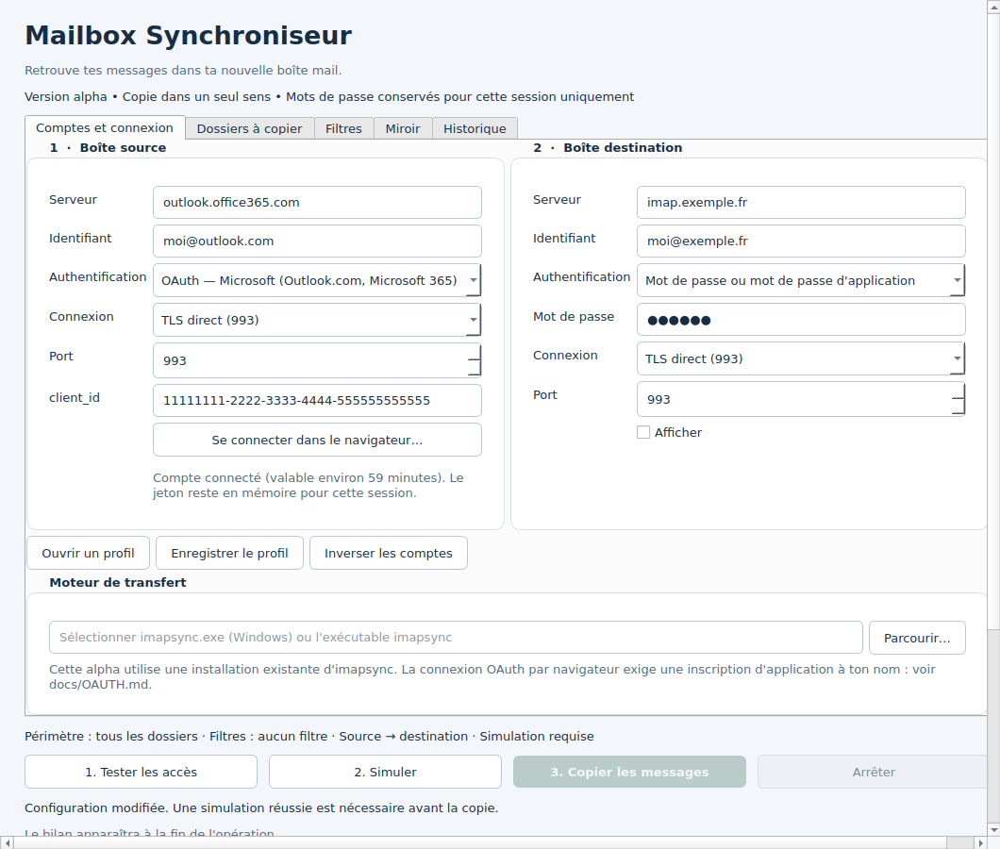
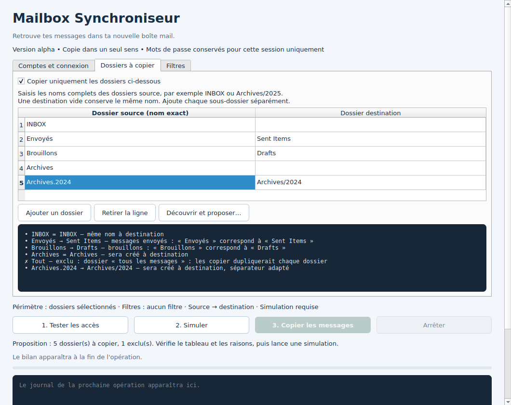
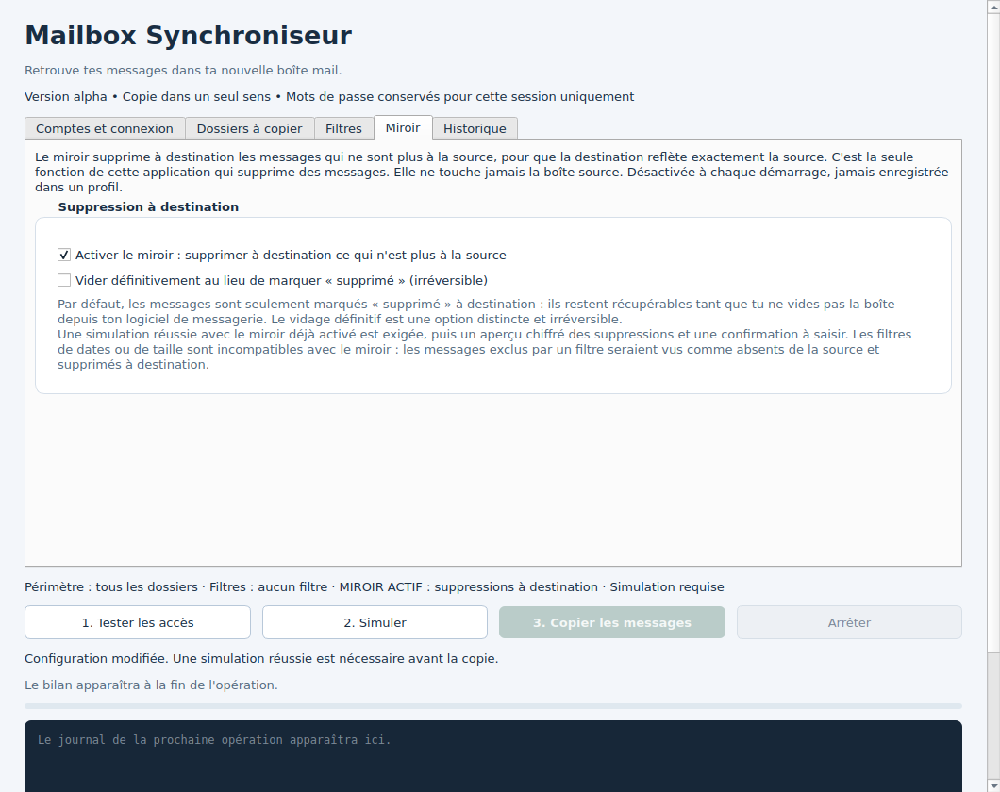
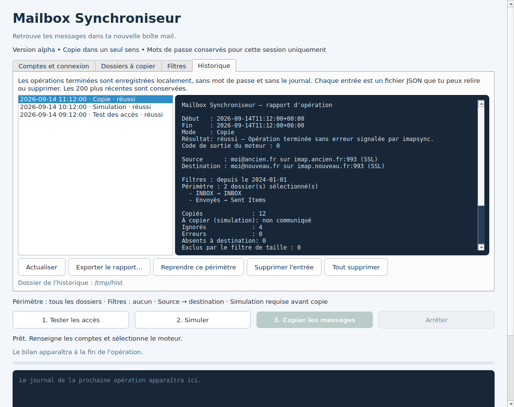

# Mailbox Synchroniseur — 0.6.0

Application de bureau en français pour copier des messages d'une boîte IMAP vers une
autre, en pilotant le moteur libre imapsync. Ce qui est vérifié et ce qui ne l'est pas
figure dans [CHANGELOG.md](CHANGELOG.md) ; l'état détaillé du projet est dans
[STATUS.md](STATUS.md) et le plan dans [ROADMAP.md](ROADMAP.md).


## Installation

**Windows** — télécharger l'installateur de la dernière version publiée et l'exécuter.
Il embarque tout : ni Python, ni Perl, ni imapsync à installer séparément. Les binaires
n'étant pas signés, Windows affiche un avertissement SmartScreen : « Informations
complémentaires », puis « Exécuter quand même ».

**Linux et macOS** — aucun paquet n'est fourni. Avec Python 3.11 ou plus récent, lancer
`sh lancer.sh` depuis les sources, puis sélectionner dans l'application un exécutable
imapsync fonctionnel. Les tests du socle passent sous Linux et Windows ; les migrations
réelles sont validées sous Linux, macOS n'est pas qualifié.

Voir aussi [le lancement depuis les sources sous Windows](#lancement-depuis-les-sources)
si tu préfères ne pas installer.

## Comment ça marche

Trois étapes, dans cet ordre, imposées par l'application :

1. **Tester les accès** vérifie que les deux comptes répondent.
2. **Simuler** montre ce qui serait copié, sans rien modifier.
3. **Copier les messages** n'est déverrouillé qu'après une simulation réussie.

Toute modification des comptes, ports, mots de passe, dossiers, filtres ou du chemin du
moteur invalide la simulation et verrouille de nouveau la copie. La copie va dans un seul
sens : la boîte source n'est jamais modifiée, sauf si tu actives explicitement le miroir,
qui ne supprime qu'à destination.

Le journal affiche les sorties du moteur, principalement en anglais, avec les mots de
passe connus masqués. Il n'est pas enregistré automatiquement.

## Connexion aux comptes

| Fournisseur | Ce qui fonctionne |
| --- | --- |
| Fournisseurs IMAP classiques | Mot de passe, ou mot de passe d'application selon le fournisseur |
| Gmail | Mot de passe d'application, avec la validation en deux étapes activée sur le compte |
| Outlook.com, Microsoft 365 | **Aucun chemin praticable** — voir ci-dessous |

Microsoft n'accepte plus le mot de passe sur IMAP, et la connexion OAuth exige d'inscrire
une application dans un annuaire Entra qu'un compte personnel ne possède pas : la voie
officielle passe par la création d'un compte Azure. L'application propose bien OAuth
(Microsoft et Google), sans identité d'application embarquée — tu fournis ton propre
`client_id` — mais cette connexion n'a été validée contre aucun serveur réel. Procédure et
limites dans [docs/OAUTH.md](docs/OAUTH.md).

TLS est obligatoire, avec vérification du certificat et du nom d'hôte, sans repli en clair.
Les mots de passe et jetons restent en mémoire pour la session : jamais dans un profil,
jamais dans le journal, jamais sur la ligne de commande.



## Choisir les dossiers

Par défaut, tous les dossiers sont copiés. L'onglet « Dossiers à copier » permet de
restreindre le périmètre et de renommer à destination. Le bouton « Découvrir et
proposer… » liste les dossiers des deux comptes en lecture seule et remplit le tableau
avec une proposition motivée ligne par ligne : nom identique, rôle reconnu (envoyés,
brouillons, corbeille, indésirables, archives), casse, séparateur de hiérarchie adapté, ou
dossier à créer. Les dossiers non sélectionnables et « tous les messages » de Gmail sont
exclus, avec leur raison affichée.

La proposition est une aide, pas une décision : le tableau reste modifiable et la
simulation reste obligatoire.



## Filtrer par dates et par taille

L'onglet « Filtres » restreint la sélection dans le périmètre choisi. Les dates sont
appliquées par le serveur sur la date interne IMAP de chaque message — date de réception
ou d'archivage, pas l'en-tête « Date » — bornes incluses. Les tailles portent sur le
message brut complet, pièces jointes comprises.

Après une simulation, le bilan indique le nombre de messages à copier et un volume estimé.
Deux réserves sur cette estimation : elle repose sur les tailles annoncées par le serveur
source, et le filtre de taille n'est pas appliqué pendant la simulation, qui ne télécharge
pas les messages — dans ce cas l'estimation est un maximum, et le bilan le précise. Le
bilan de copie affiche, lui, le volume réellement transféré.


## Miroir : la seule fonction qui supprime

Le miroir supprime **à destination** les messages qui n'existent plus à la source. C'est la
seule fonction capable de supprimer des messages, et **la boîte source n'est jamais
touchée** : aucune option de suppression côté source n'est passée au moteur, dans aucun mode.

Par défaut, les messages sont seulement marqués « supprimé » à destination : ils restent
récupérables tant que la boîte n'est pas vidée depuis le logiciel de messagerie. Le vidage
définitif est une option distincte et irréversible.

Quatre garde-fous cumulés : la case est décochée à chaque démarrage et n'est jamais
enregistrée dans un profil ; une simulation réussie du même plan, miroir déjà activé, est
exigée ; cette simulation annonce le nombre exact de suppressions sans rien supprimer ; et
la copie demande de saisir `SUPPRIMER` au clavier. Les filtres sont refusés avec le miroir,
puisque les messages exclus par un filtre seraient vus comme absents de la source.



## Bilan, historique et rapports

Le bilan reprend les compteurs publiés par imapsync : copiés, ignorés, erreurs, absents à
destination, volume. Un compteur absent vaut « non communiqué » — rien n'est inventé. La
présence confirmée concerne les messages identifiés par le moteur dans le périmètre choisi ;
ce n'est pas un contrôle SHA-256 de chaque boîte, lequel appartient à la suite de tests.
Après un arrêt ou une erreur, la présence complète n'est jamais annoncée.

Chaque opération terminée est enregistrée localement, en JSON, sans mot de passe et sans le
journal. L'onglet « Historique » permet de relire un rapport, de l'exporter en texte, de
reprendre le périmètre et les filtres d'une exécution passée, ou de tout supprimer. Ces
fichiers sont en clair et contiennent adresses, serveurs et noms de dossiers.



## Profils

Un profil enregistre comptes, périmètre et filtres, **jamais les mots de passe**. Le charger
efface les secrets et oblige à resélectionner l'exécutable du moteur : un fichier de profil
n'autorise pas l'exécution d'un programme. Les profils v1 et v2 restent lisibles ; les
nouveaux sont en v3.

## Lancement depuis les sources

**Windows.** Extraire entièrement l'archive dans un dossier — pas depuis l'intérieur du ZIP —
installer Python 3.11 ou plus récent avec le lanceur `py`, puis double-cliquer sur
**Lancer-Windows.bat**. Un environnement `.venv` est créé au premier lancement et PySide6
téléchargé. Il faut ensuite sélectionner soi-même un `imapsync.exe` de confiance : le
lancement depuis les sources n'en fournit pas, l'installateur si.

Alternative PowerShell, depuis le dossier extrait :

```powershell
py -3 -m venv .venv
.\.venv\Scripts\python.exe -m pip install -e .
.\.venv\Scripts\python.exe -m mailbox_sync
```

**Linux et macOS.** `sh lancer.sh`, avec Python 3.11 ou plus récent.

## Moteur imapsync

Sources amont : https://github.com/imapsync/imapsync
Documentation et distributions de l'auteur : https://imapsync.lamiral.info/

Le code amont est libre, sous licence NLPL. L'installateur Windows embarque un binaire
construit depuis le commit amont épinglé et vérifié par empreinte SHA-256
(`packaging/build-engine.ps1`). Les archives de sources n'en contiennent aucun.

Le contrat utilisé est celui de la version **2.314**, testée sous Linux avec GreenMail 2.1.3
(TLS direct), pymap 0.36.7 (STARTTLS) et Dovecot 2.3.21 (quota strict). Voir
[les essais reproductibles et leurs limites](docs/INTEGRATION.md).

## Limites

**Non vérifié** : macOS, les très gros volumes, les migrations réelles sous Windows au-delà
de l'essai d'installation, Gmail et Microsoft 365 en conditions réelles, la désinstallation
propre. Les binaires ne sont ni signés ni notariés.

**Hors périmètre, délibérément** : synchronisation bidirectionnelle, déplacement (copier
puis supprimer à la source), contacts et calendriers, planification, coffre système pour les
secrets, limites de débit, progression et temps restant — le moteur ne fournit pas de donnée
assez fiable pour les calculer honnêtement.

**À savoir avant de migrer** :

- Une copie interrompue reste partielle : arrêter n'annule pas les messages déjà copiés, et
  une erreur du moteur signifie qu'une copie peut être incomplète.
- Les états des messages déjà présents à destination ne sont pas resynchronisés.
- Les certificats doivent être acceptés par le magasin de confiance de l'installation
  imapsync/Perl ; l'application n'offre aucun moyen de désactiver leur vérification. La
  découverte des dossiers utilise, elle, le magasin de Python : un certificat accepté par
  l'un peut être refusé par l'autre.
- Les secrets restent dans la session et dans l'environnement du processus enfant pendant
  son exécution. Cela ne protège pas d'un autre processus local privilégié.
- Les profils contiennent adresses et noms de serveurs ; le journal peut contenir adresses
  et noms de dossiers.

## Développement

```sh
python -m pip install -e '.[dev]'
python -m pytest -q
```

Sur une machine Linux sans affichage : `QT_QPA_PLATFORM=offscreen python -m pytest -q`.
Sans activation explicite, les essais IMAP sont ignorés ; le socle et l'interface sont
vérifiés avec un moteur simulé. Les essais réels nécessitent les dépendances de
[docs/INTEGRATION.md](docs/INTEGRATION.md). Aucun compte utilisateur n'est utilisé.

L'intégration continue exécute 223 tests du socle sous Linux et Windows, et 23 essais IMAP
réels sous Linux. STATUS.md nomme, pour chaque jalon, le run et le commit testé.

Licence MIT pour le code original. Voir LICENSE et THIRD_PARTY.md pour les composants
distribués.

